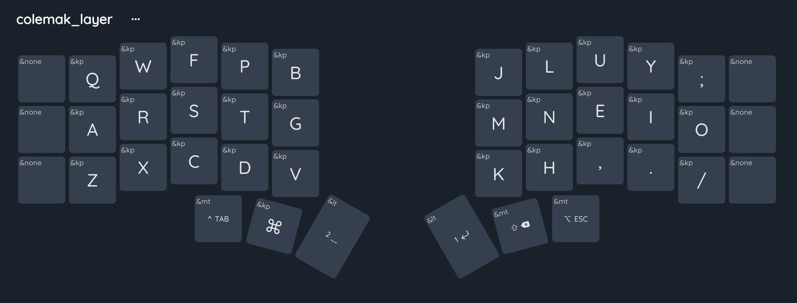
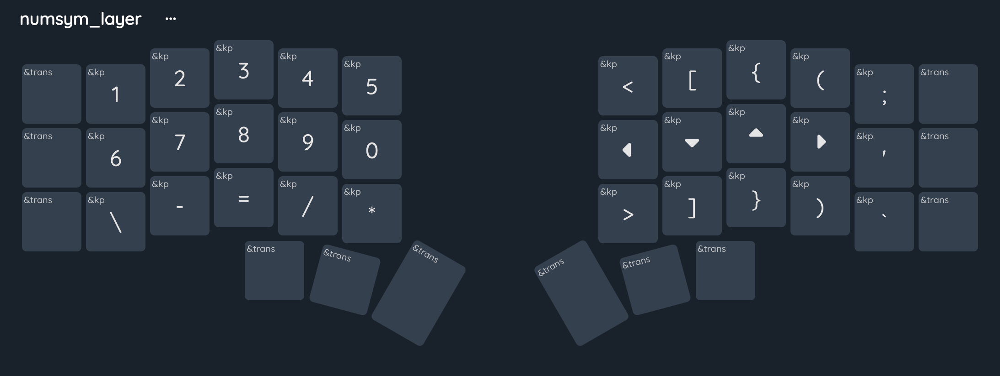
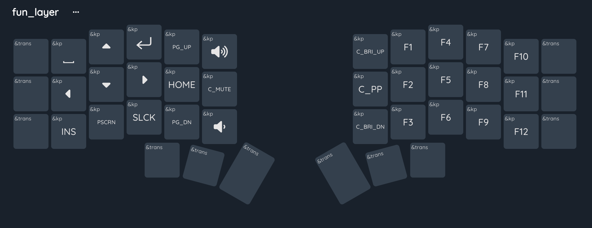
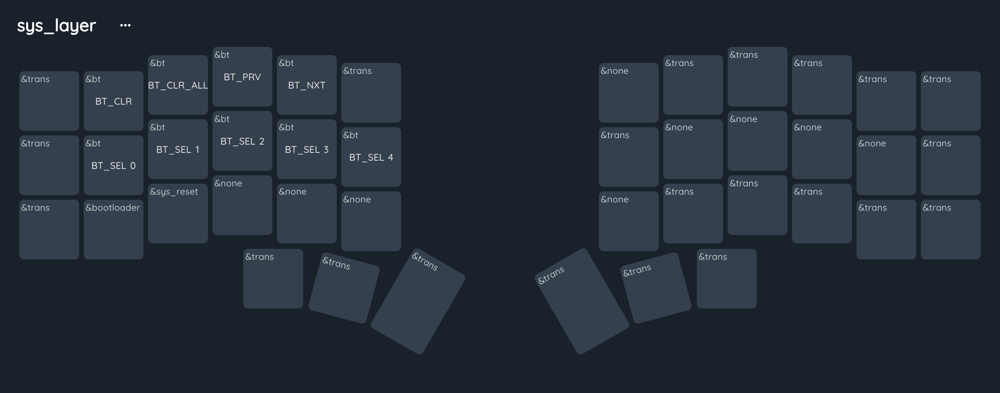
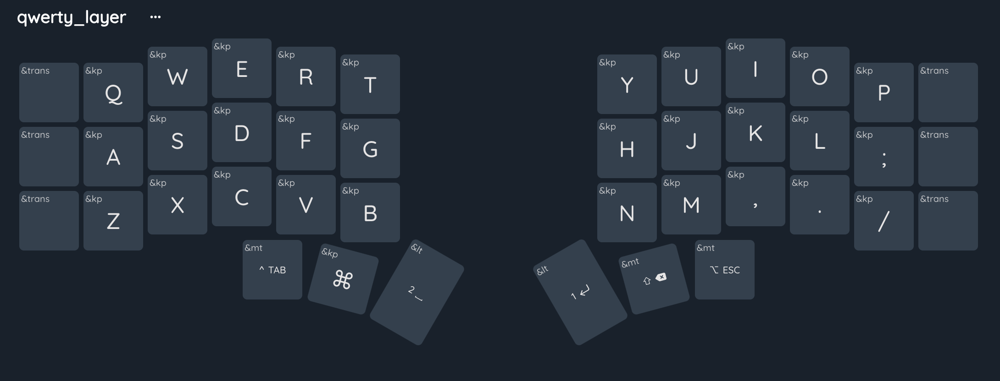
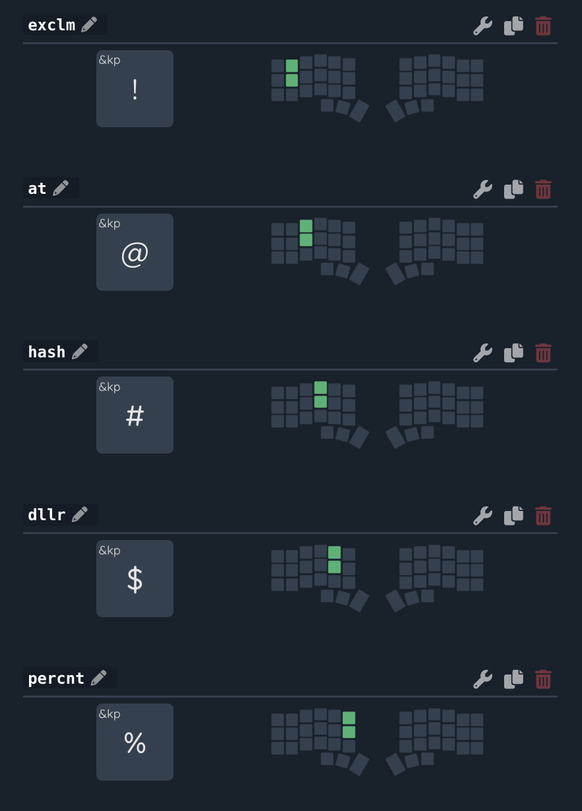
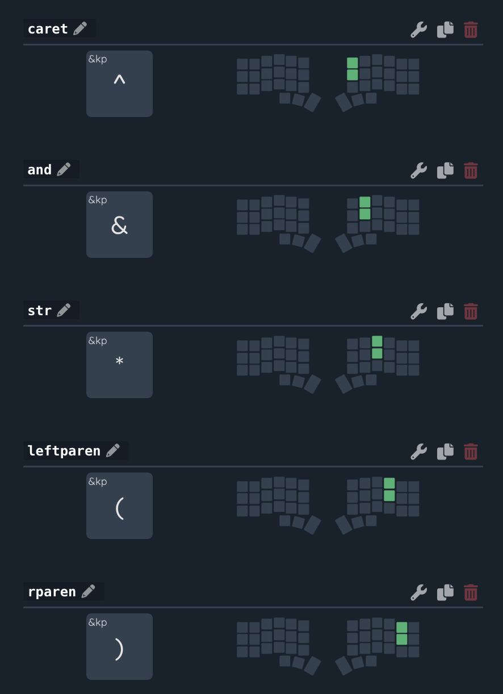
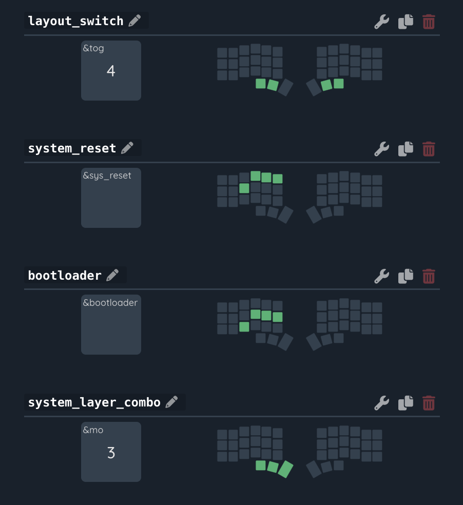
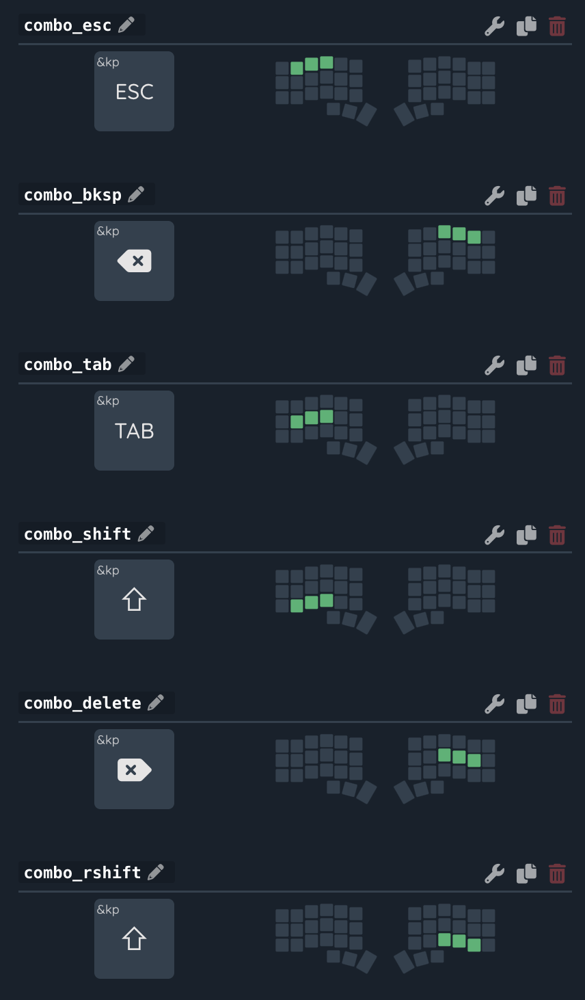

# corne-zmk-5-column

## Chillmin Layout

# Introduction to chillmin Layout

## Layout philosophy

- convinience is priority and minimal by design
- primary **colemak mod-dh** layer for alpha
- **coding friendly** symbol layer for nums and symbols
- **fun layer** for media and other functional stuff
- **system layer** for system level controls
- toggle option to qwerty layer for boomer compatibility
- uses only 36 keys

## Base layer and mods

- The CM Layout has 5x3 keys per hand so we can only fit
  the main alphabets so we need to use other ZMK features to fit our mod keys.

### Base layer

Colemak layer as base only important thing is the modifier keys, enter end space keys.

- Enter keys has layer tap feature, that means holding it will momentarily enble the 1 indexed layer.

### Number and Symbols Layer

- Design for keeps same use case keys closer.
- Brackets for coding convenience
- Arrow keys for like vim

## Fun layer

## System layer

## Qwerty layer

- For boomer compatibility

## Other combos

