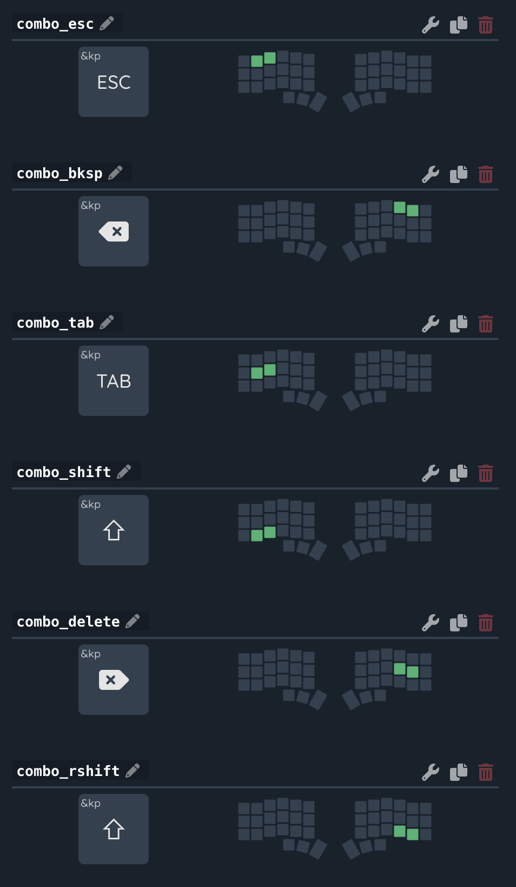
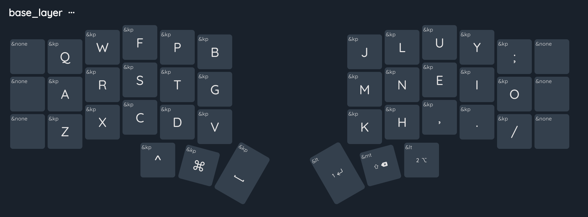
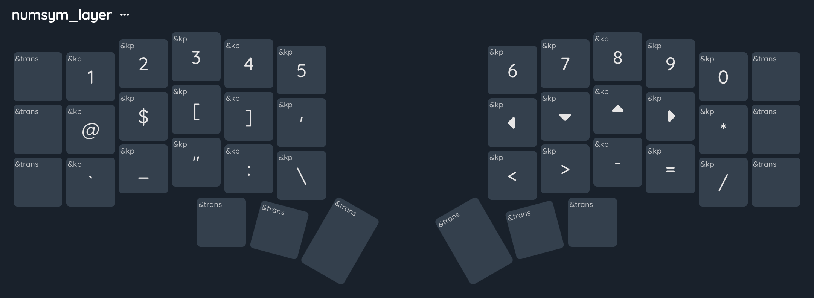
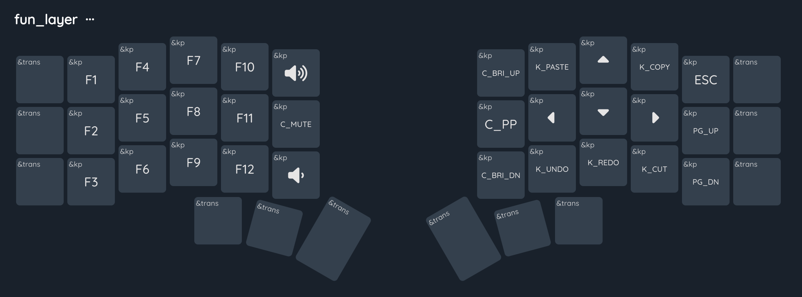
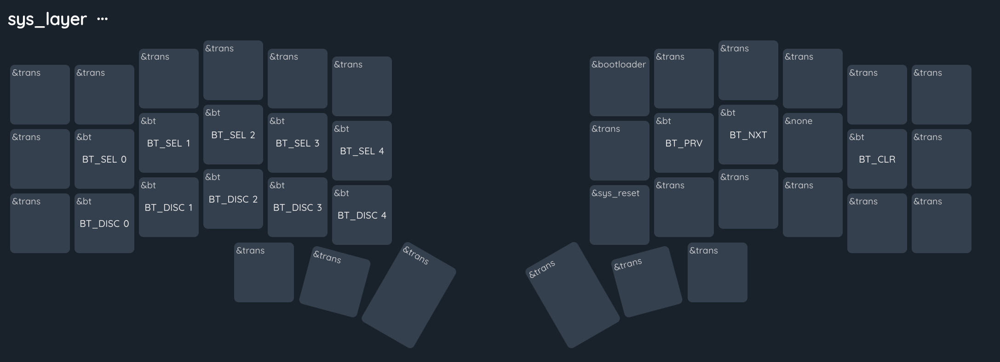

# corne-zmk-5-column

## Chillmin Layout

# Introduction to chillmin Layout

## Layout philosophy

- familiar design for the qwerty alphas
- convinience is priority and minimal by design 
- uses only 36 keys 

## Base layer and mods

- The CM Layout has 5x3 keys per hand so we can only fit 
 the main alphabets so we need to use other ZMK features to fit our mod keys.

- We use side two key as combos for the side bar keys

### Base layer 

This is nothing new, only important thing is the modifier keys, enter end space keys.  
- Enter keys has layer tap feature, that means holding it will momentarily enble the 1 indexed layer. 

 

### Number and Symbols Layer 

- Here we have both num pad and num row
- Rest of the symbols with some repeats 
- Design for keeps same use case keys closer.

## Fun layer

## System layer

